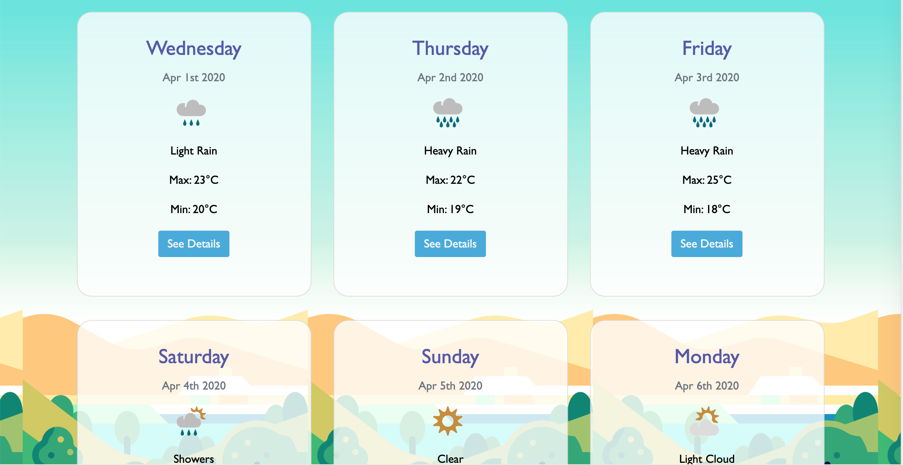

# weatherApp

This is a simple weather app build in React and using https://www.metaweather.com/api/ Api 

Axios is used to fetch the data from Api

### Dependencies

The front end of this application was bootstrapped with [Create React App](https://github.com/facebook/create-react-app).

#### `yarn start`

Runs the app in the development mode. 
Open [http://localhost:3000](http://localhost:3000) to view it in the browser.

The page will reload if you make edits. 
You will also see any lint errors in the console.
